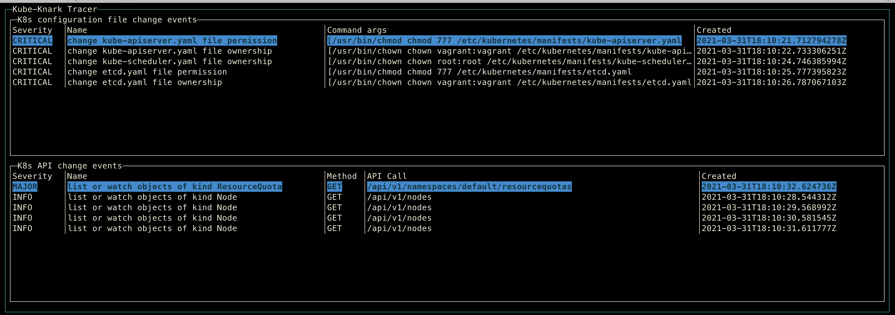

[](https://goreportcard.com/report/github.com/chen-keinan/kube-knark)
[](https://github.com/chen-keinan/beacon/blob/main/LICENSE)
[](https://travis-ci.com/chen-keinan/kube-knark)

[](https://gitter.im/kube-knark/community?utm_source=badge&utm_medium=badge&utm_campaign=pr-badge)
<br><br>
# Kube-Knark Project
###  Trace your kubernetes runtime !!
Kube-Knark is an open source  tracer uses ebpf technology to perform runtime tracing on a deployed kubernetes cluster. it tracing the kubernetes API execution and master node configuration files permission changes. the trace results are leveraged via go plugin webhooks

###kube-knark trace the following :
- The full [Kubernetes API specification](https://kubernetes.io/docs/reference/kubernetes-api/) execution calls especially mutation <br> 
- kubernetes master node configuration files permission changes [CIS Kubernetes Benchmark specification](https://www.cisecurity.org/benchmark/kubernetes/)

kube-knark tracing data are reported :
- Console dashboard
- Go Plugin hooks

kube-Knark console:
<br><br>

* [Requirements](#requirements)
* [Installation](#installation)
* [Quick Start](#quick-start)
* [User Plugin Usage](#user-plugin-usage)
* [Supported Specs](#supported-specs)

## Requirements
- Go 1.10+
- Linux Kernel 4.15+
- Clang < 10
- LLVM
- Kernel Headers

## Installation
```
git clone https://github.com/chen-keinan/kube-knark
cd kube-knark
make build
```
## Quick Start
Execute kube-knark without plugins 
```
 ./kube-knark 
```
## User Plugin Usage (via go plugins)
The Kube-knark expose 2 hooks for user plugins [Example](https://github.com/chen-keinan/kube-knark/tree/master/examples/plugins) :
- **OnK8sAPICallHook** - this hook accepts k8s api call event with all details (http request /response ,matching API spec) 
- **OnK8sFileConfigChangeHook** - this hook accepts master file configuration change event with command details (chown or chmod ,args and matching file change spec)

##### Copy plugin to folder (.kube-knark folder is created on the 1st startup)
```
cp <plugin>.go ~/.kube-knark/plugins/source/<plugin>.go
```
## Supported Specs 
The Kube-knark support 2 specs and can be easily extended:
- The full k8s API spec [Kubernetes API specification](https://github.com/chen-keinan/kube-knark/tree/master/internal/spec/api)
- master config file change spec [Master Node Config](https://github.com/chen-keinan/kube-knark/tree/master/internal/spec/filesystem)

both specs can be easily extended by amended the spec files under ```~/.kube-knark/spec``` folder

## Contribution
- contribution are welcome !!
- contribution with tests and passing linter are more then welcome :) 
