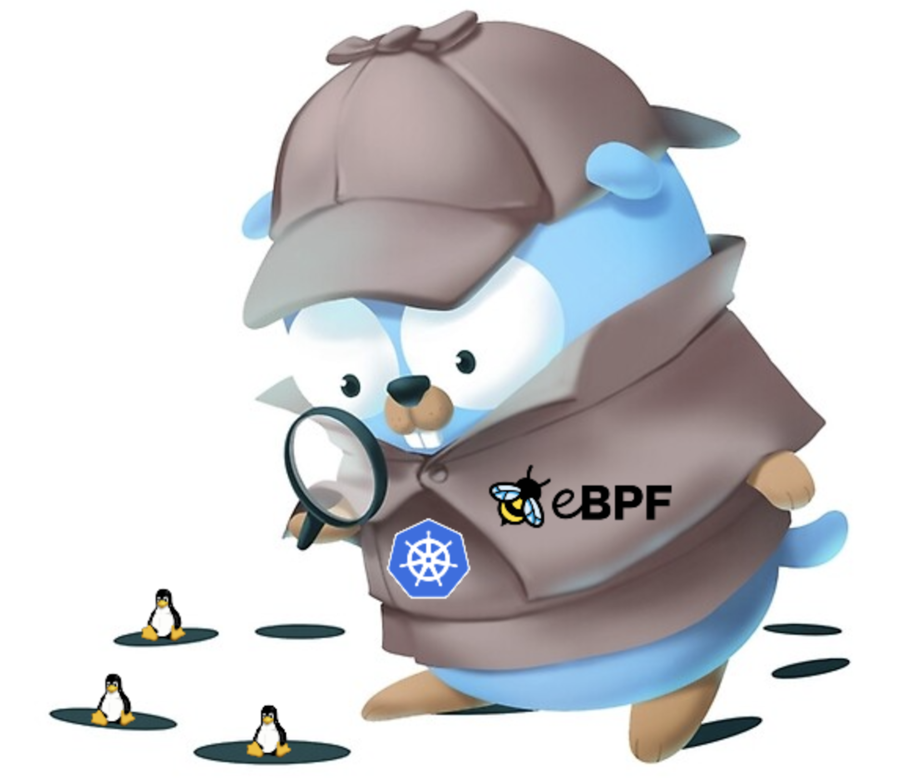

  
# Kube-Knark Project
###  Trace your kubernetes runtime !!
Kube-Knark is an open source audit tracer who perform run time on a deployed kubernetes cluster looking for malware code execution.

### Requirements
- Go 1.10+
- Linux Kernel 4.15+
- clang < 10
- llvm
